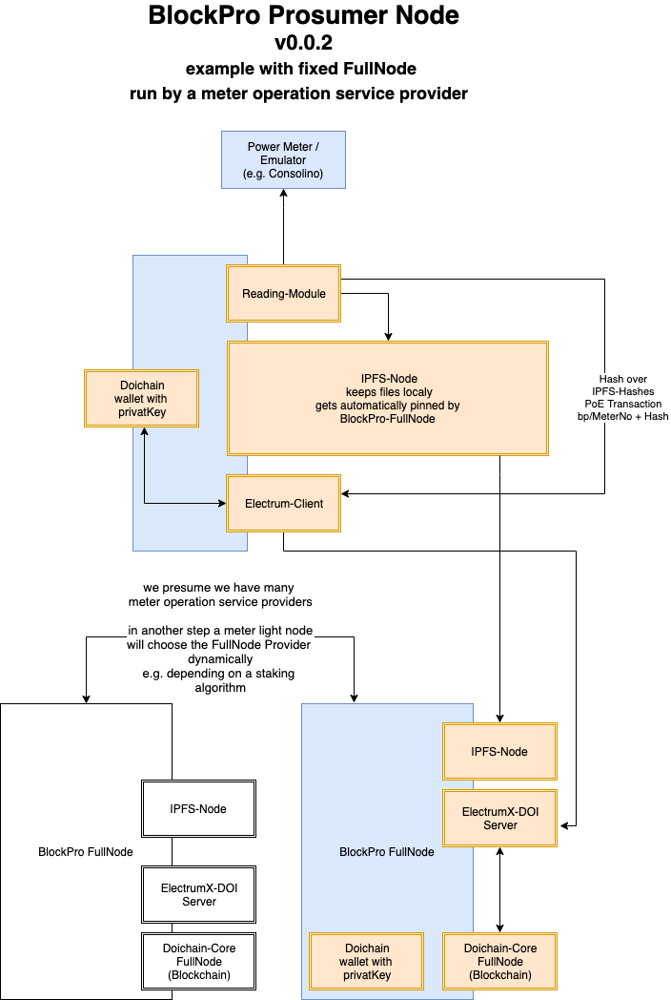

# BlockPro
**(draft blockchain architecture)**

## Mission: Open, decentralized, permissenless and trustless protocol for energy consumers and suppliers

# Table of Contents
- [Blockpro Hardware](#blockpro-hardware])
- [Blockpro dApp](#blockpro-dapp)
- [Meter Reading module](#meter-reading-module)
- [The-KW-Token](#the-kw-token)
- [Nano-Ledger App für Doichain](#nano---ledger-app-für-doichain)
- [Decentralized "KW/h-Token" Exchange](#decentralized-"kw/h---token"-exchange)
- [Other tasks](#other-tasks)
- [Attack Scenarios and how to prevent it](#Attack-Scenarios-and-how-to-prevent-it)
- [Other blockchain based projects](#Other-blockchain-based-projects)
- [Questions, concerns, thoughts](#Questions-concerns-thoughts)

## Modules
### **Blockpro Hardware** 
  - BlockPro Prosumer meter (sealed)
  - BlockPro Light Node (on RaspberryPi) (sealed)
    - OS and packages
    - Image and installation
### **BlockPro dApp**
  - BlockPro node & meter onboarding procedure
    - First start scenario and procedure
      - As BlockPro meter and prosumer node are started first time, the dApp generates a private key which mustn't shown to anybody at anytime
      - Meter and node must be sealed together after onboarding procedure from the electrician
      - The dApp's web frontend is available over HTTPS (!) on LAN. official SSL wildcard certificate is needed
      - In parallel the client, the BlockPro meter & node operator is installing the decentralized BlockPro wallet appp on his smartphone or tablet and generates his seed phrase. The wallet connects directly to the meters dApp.
      - The resulting public key can be entered to the BlockPro dApp which produces a 1/2 multisig address between client and BlockPro node address. Produced or consumend energy will be stored on that address from the BlockPro node and can be transfered then via the dencentralized exchange to possible consumers.
      - After physically seeling both BlockPro dervices, the technician has to sign the multisig address on a blockchain
  - BlockPro decentralized wallet (hosted on IPFS)
      - shows total amount of produced/consumend KW/h of the meter
      - shows total amount of produced/consumend KW/h in the last hour, today, yesterday, this week, this month, this year, last year, etc.
      - visualizes the data in diagrams
      - shows the balance in DOI
      - shows sold / bought KWH-Token (this hour, last hour, next hour, today, yesterday, tomomrrow, this week, last week, next week, ...)
      - integrates the decentralized "KW-Token" Exchange
      - integrates a hardware wallet to store Doicoin (e.g. Nano-Ledger) and sign KWH-Deals in teh "KW-Tokeen" Exchange
  - BlockPro meter and node certification procudure done by the electrician
      - the electrician signs a Doichain transaction which adds the new BlockPro node as 'valid' by him e.g. through a 'name_doi bp/meterNo' record on Doichain on consumer nodes can verify such a node as they trust the electrician
      - any electrician can form an organization on the Doichain by adding a name_doi transaction on Doichain e.g. via 'name_doi bp_organization/OrganizationName value: ipfs-hash of a file which contains the list of publicKeys of electrician members'
      - Consumer and Producer are accepting an organization which allows them to trustlessly buy and sell KW-Tokens (see exchange)
### **Meter Reading module**
  
  - is a software module installed on a RaspberryPi which connects in a defined time to the meteor and reads the produced and consumed KW/h
  - since these data are coming unsigned from the meteor we need to seal the RaspberryPi together with the meter or put both parts into one seeled case.
  - the read data are written into a file on ipfs the resulting hash is to another cumulative file containing the read data from the last hour (or 30 minutes etc.)
### **The KW-Token**
  - When writing the produced and/or consumend kw/h into IPFS the resulting hash of the latest cumulative file must be writen into blockchain. 
  - this can be done by executing name_doi command with nameId bp-meter/meterNo and as value the amount of produced (e.g. +30 KW/h) or consumed (e.g. -1 KW/h)
  - this transaction also includes the IPFS-hash which contains the detail kw/h meteor proofs
  - listing all name_doi transactions of a meteor by calling name_list bp-meter/meterNo would calculate total balance of kwh
### **Nano-Ledger App für Doichain**
### **Decentralized "KW/h-Token" Exchange**
  - offered KW/h for the future are beeing traded and written into public ipfs (*unencrypted*? If no which (public)Key encrypts it?)  
  - a producer offers to produce x KW/h next week, next month etc. 
  - a consumer offers to buy x KW/h next week, next month etc. 
  - a producer can accept an buy-offer of a consumer
  - a consumer can accept an sell-offer of a producer
  - when a offer is accepted by the consumer 
    - a deal transaction is stored by the consumer on Doichain via name_doi bp-deal/meteorNo 
    - the value of this transaction contains:
      - the meteorNo of the producer
      - the ordered amount of kw/h 
      - aggreed price in DOI (or later possibly other crypto currencies)
    - the Bob (consumer) sends the aggreed amount of DOI to a multisig account with Alice (the producer)
    - as the aggreed amount of KW/h was delivered Alice (producer) creates and signs a DOI (coin) - transaction (offchain( to Bob to transfer the aggreed DOI from the multisig to her wallet. Bob signs this transaction and pays the electricity bill.  
    - How to solve disbutes? Alice delivered but Bob doesn't sign the transaction? Who is going to help? 
### **Other tasks & thoughts**
  - Rebranding Doichain
  - tDOI on Ethereum blockchain and other trojan horses to buy and sell DOI (see and fork: https://tbtc.network/) 
  - Should KWH/Token be possible to directly be sold on other crypto exchanges? Is that at all possible or even useful? 
### **Attack Scenarios and how to prevent it**
  - attacker removes seel and writes non-legit data the blockchain, sells not produced KWH-Token or doesn't pay for the in reality produced electricity
  - 51% Blockchain attack
### **Other blockchain based projects**
  - EnergyWeb http://energyweb.org/
### **Licences**

### **Questions, concerns, thoughts**
  - how to solve price instability of traded KW/h in DOI? Can we implement a automatic price adjustmet when DOI to EUR/Dollar or BTC changes? 
  - do we need an automated interface to another crypto exchange to automatically sell DOI to the current price?  
  - electricity can only be sold for the future and not for the past 
  - what should happen if a consumer concumes energy he didn't pay for?
  - what happens with energy the producer produced but didn't sell?
  - who can make a list of exchanges and their conditions to list Doichain?
  
